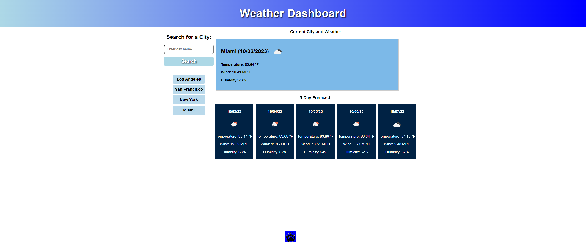

## Weather Dashboard

## Description
This project was all about learning how to use already compiled information on a site of my own making.  I was given the task of using the openweathermap API to populate a weather dashboard.
I first needed to find a way to not only have the api search for a city of my choosing, but also have it display not only the current weather but also give me a 5 day forecast for that city.
To make it even more useful I added a recently searched section, so that users can go back and check the difference between cities they recently searched.  I was also tasked with giving relevant
information for each weather day as well as including a weather icon provided to me by the openWeathermap API themselves.    

Styling this project was fairly simple, until I overlooked one big thing. Initially I had my searched cities as an unordered list, which automatically styled them in a way.  I couldn't figure out 
why the results would not center themselves into relation with other things.  It taught me that sometimes you can get so involved in things you can overlook something super simple.  I was able to figure out
the issue and apply the appropriate fix. 

This project was also very interesting to use with console log commands.  Gave me a real insight to how much information we can pull and populate in a way that we decide.   I believe that if someone was looking to 
plan a trip in the next few days, that this site could be quite helpful for them.

## Installation
Deployed at https://slemjosh.github.io/weather-dashboard

## Usage

## Credits
Normalize.css provided by
https://github.com/necolas/normalize.css/

OpenWeatherAPI
https://openweathermap.org/api

## License

Please refer to the LICENSE in the repo
